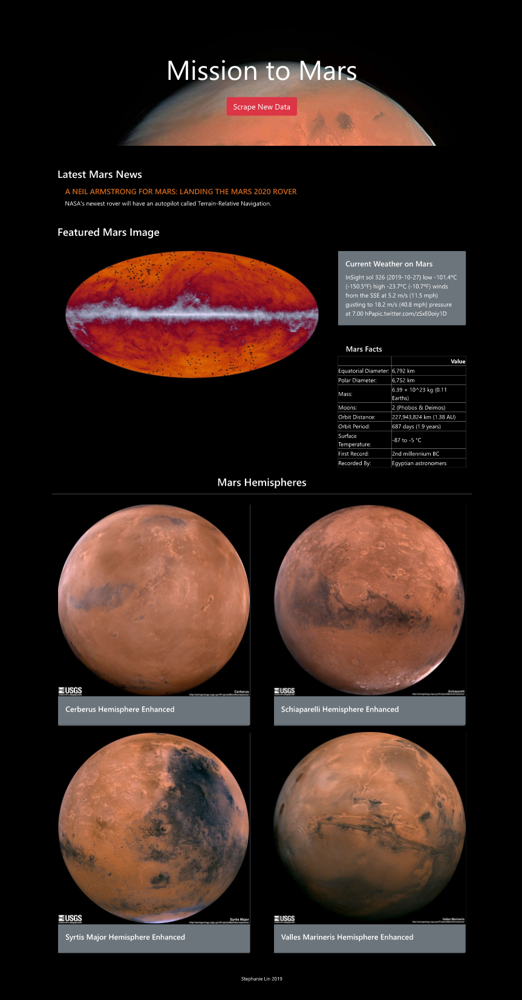

# Mission to Mars

Use MongoDB with Flask templating to create a new HTML page that displays all of the information that was scraped from the URLs below.

### NASA Mars News

* Scrape the [NASA Mars News Site](https://mars.nasa.gov/news/) and collect the latest News Title and Paragraph Text. Assign the text to variables that you can reference later.

### JPL Mars Space Images
* Visit the [JPL](https://www.jpl.nasa.gov/spaceimages/?search=&category=Mars) site to collect its featured image.

### Mars Weather
* Display the lastest tweet from the [Mars Weather](https://twitter.com/marswxreport?lang=en) twitter account

### Mars Facts
* Visit the [Mars Facts](https://space-facts.com/mars/) page to collect the table which renders facts about Mars.

### Mars Hemispheres
* Visit the [USGS Astrogeology](https://astrogeology.usgs.gov/search/results?q=hemisphere+enhanced&k1=target&v1=Mars) site to obtain high resolution images for each of Mars' hemispheres.

